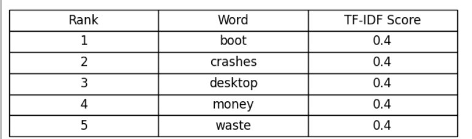

# DataScienceAndBigDataAnalyticsProject
---
## Setup for MongoDB server
mongo is installed, so you can use *pymongo_importdata.py*
this program import "clean_sample.csv" into mongoDB

when you have "clean_sample.csv" at current directory,
```bash
python3 pymongo_importdata.py
```

```bash
mongo
show collections
db.clean_sample_reviews.find().limit(10).pretty()
```

```plaintext
MongoDB shell version v3.6.8
connecting to: mongodb://127.0.0.1:27017
Implicit session: session { "id" : UUID("a3ba028f-a18e-483c-8c64-c9574d92e3cc") }
MongoDB server version: 3.6.8
Welcome to the MongoDB shell.

clean_sample_reviews

{
	"_id" : ObjectId("685f144f95ab191fc705cd6f"),
	"app_id" : 10,
	"app_name" : "Name of the game",
	"review_text" : "Good Game.",
	"review_score" : 1,
	"review_votes" : 0
}
```


## hypothesis
### H1 Word Frequency in Positive vs Negative Reviews
- Identify emotional language differences between positive and negative reviews

#### How to use
if you have results "output_h1.txt", you can make it into MongoDB:
```bash
python3 import_output_to_mongo.py output_H1.txt
mongo
use game_reviews_db
db.output_h1_keywords.find().pretty()
```
The data is saved as follows:
```plaintext
{
        "_id" : ObjectId("685f1f3931447ec680419a4c"),
        "sentiment" : "neg",
        "keyword" : "fun",
        "count" : 1001
}
```

### H2 Games with Most Negative Reviews
- Find games with unusually high negative sentiment ratio

### H3 Lexical Diversity in Reviews
<!-- Lexical  -->
- Determine if positive reviews have richer vocabulary than negative ones. 

### H4 The detection of concrete, helpful Keywords (for understanding representation of user's expression, for improving the game)
<!--具体的なremarkの検出-->

#### Process Overview
1. **Data Filtering**: Remove trivial reviews (e.g., "10/10", ":)", "good game") from MongoDB
2. **Objectivity Analysis**: Use TextBlob to filter for objective reviews (subjectivity score = 0.0)
3. **Vote-based Selection**: Keep only reviews with high user votes (review_votes > threshold)
4. **TF-IDF Extraction**: Calculate Term Frequency × Inverse Document Frequency for each game and sentiment
5. **Output Generation**: Produce meaningful keywords that provide actionable insights for game developers

#### Table 1: Negative Reviews - Aces of the Galaxy


The TF-IDF (Term Frequency-Inverse Document Frequency) scores above represent the importance of words within each game's review sentiment:

**High TF-IDF patterns observed:**
- **Counter-Strike**: Classic gaming terms dominate positive reviews (classic: 65.9, old: 62.4)
- **Call of Duty: World at War**: Zombies content highly valued (zombies: 97.3 positive vs 9.9 negative)
- **Call of Duty: Modern Warfare 2**: Strong positive sentiment indicators (fun: 28.2, perfect scores: 26.9)
- **A.V.A. Alliance of Valiant Arms™**: Controversial elements appear in both sentiments (knife: 15.3 positive, 21.6 negative)

**Common negative indicators across games:**
- Technical issues: "crashes", "doesnt", "cant"
- Value concerns: "money", "waste", "buy"
- Gameplay problems: "dont", "get", "work"

**Key insights:**
- Game-specific terminology shows highest TF-IDF scores
- Generic positive words (fun, game, play) appear consistently but with lower scores
- Technical complaints have moderate but consistent TF-IDF scores across titles

#### pre-analysis
- First, I analyse with `textblob:subjectivity` score, which makes a grade from 0(Objective) to 1(Subjective).
I pick up the comment which seems to be helpful for improving game, which is profittable to the game company.

| Index | Subjectivity | Review Text                                      |
|-------|--------------|--------------------------------------------------|
| 7     | 0.000        | cs 1.6 is crashing after the update... please fix asap! |
| 100   | 0.000        | You can shoot through walls.                     |


### H5 Repair broken or null review_score with Logistic Regression model
- With this model, `review_score` can be predicted with high percentage. This model can repair the `review_score` when this data is not collected.

#### Technologies
- Hadoop: Preprocessing into BOW(Bag of Words)
- Pyspark: Implementing model
- MongoDB: Store the infomation


#### Evaluation Results:
  • ROC-AUC: 0.8482\
  • Accuracy: 0.8732

Sample Predictions: (Prediction: 1.0 = Positive, 0.0 = Negative. [P(pos),P(neg)])

| Review Text | Actual Label | Prediction | P(Positive) | P(Negative) | Correct? |
|-------------|--------------|------------|-------------|-------------|----------|
| *(empty)* | 1 | 1.0 | 0.0828 | 0.9172 | ✓ |
| property | 1 | 1.0 | 0.0118 | 0.9882 | ✓ |
| back in my day! | 1 | 1.0 | 0.0390 | 0.9610 | ✓ |
| pluses : nostalgia, simple gameplay. minuses : graphics of ten-year prescription. game counter strike is recommended who missed game clubs and the school and student's days spent to us! | 1 | 0.0 | 0.9043 | 0.0957 | ✗ |
| &lt;3 love it *__* | 1 | 1.0 | 0.0423 | 0.9577 | ✓ |
| . | 1 | 1.0 | 0.0828 | 0.9172 | ✓ |
| ... | 1 | 1.0 | 0.0828 | 0.9172 | ✓ |
| 10/10. that's all i need to say. | 1 | 1.0 | 0.0058 | 0.9942 | ✓ |
| 9/10 | 1 | 1.0 | 0.0391 | 0.9609 | ✓ |
| :) | 1 | 1.0 | 0.0828 | 0.9172 | ✓ |

**Accuracy in sample**: 9/10 (90%)

#### How to run 
please make sure that there's  `clean_sample.csv` in /user/ubuntu/reviews/
```
./run_mapreduce.sh
./run_logisticregression_local.sh
```